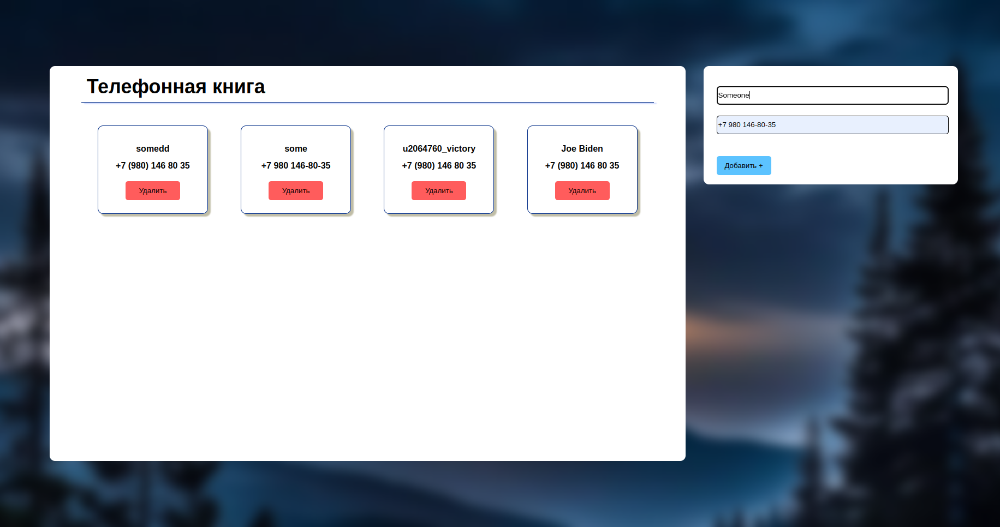

Маленькое веб приложение телефонной книги без фреймворков с сохранением данных в JSON.

    Поднятие одной командой через докер.
        http://127.0.0.1:8080/
            Если возникнет проблема при попытке нажатия на кнопки то попробуйте ввести эту команду- hmod -R 777 src/data/

 

